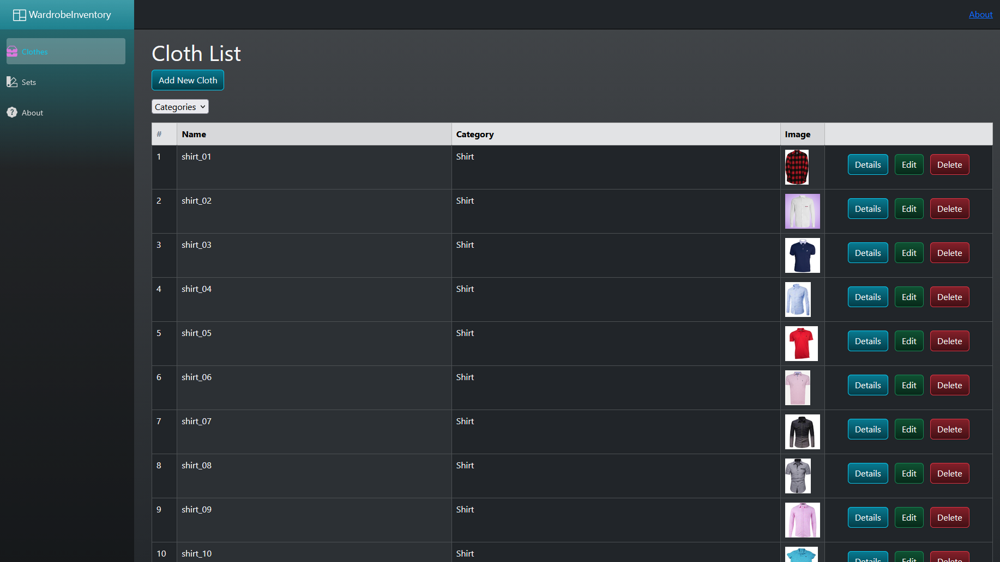
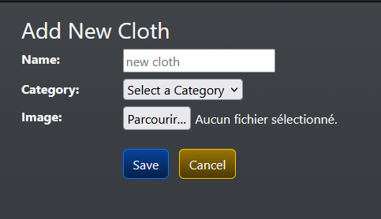
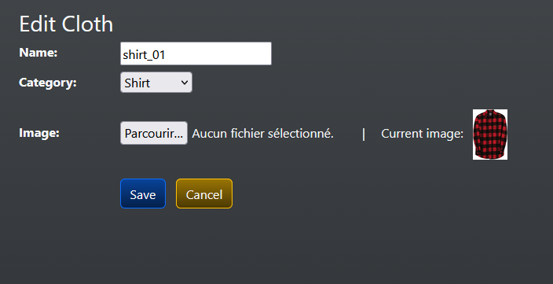
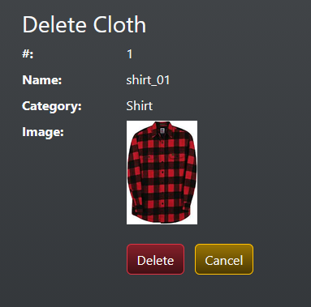
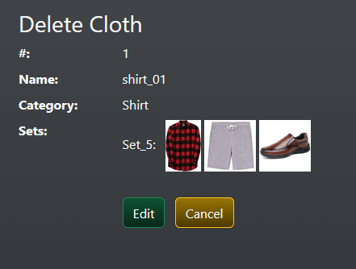
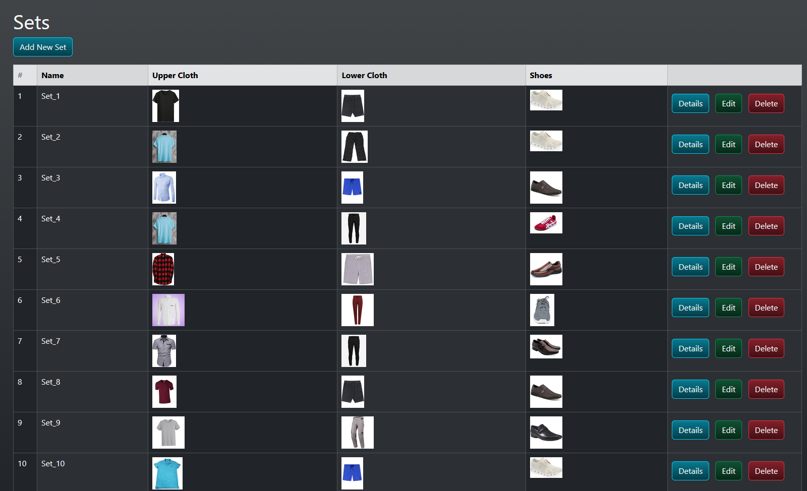
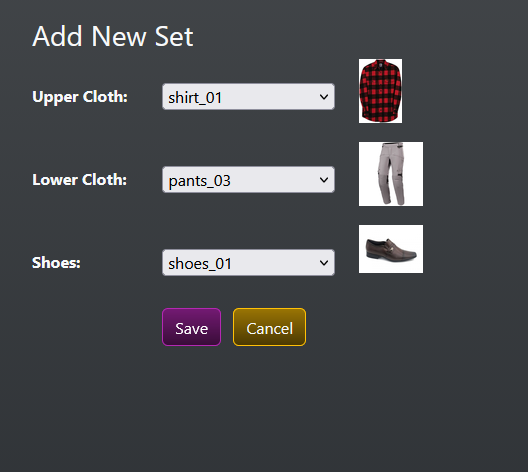
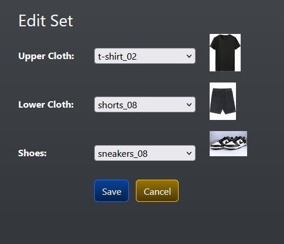
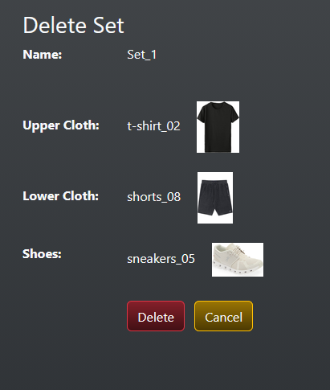
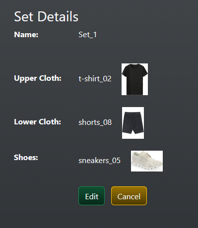

# Wardrobe Inventory
By [Zube Pierre Basali](https://zubepb.github.io) for [The C# Academy](https://thecsharpacademy.com/).

## Requirements
- This is an application where you should store and retrieve wardrobe data.

- You can choose whatever database solution you want: Sqlite, SQL server or whatever you're comfortable with.
- You should use Entity Framework.
- Your database should have a single table. The objective is to focus on learning Blazor, so we should avoid the complexities of relational data.
- Users of your app need to be able to upload pictures of wardrobe items.
- You can't use Javascript Interop. The objective is to stay away from JS, even though it's still possible to use it.

## Strucure
The project uses an SQLite database managed by repositories, services, and controllers. 
The UI is managed by blazor using a combination of blazor pages and bootsrap.

No Javascript was used (except for alerts), this application focuses on blazor syntax.

### Clothes
Cloth presents the data in a table, blazor pagination is used to navigate through it. 

An image can be uploaded when adding/editing the cloth. 
The image will take the name of the cloth when uploading.

Add:

Edit:

Delete:

Details:

### Sets/Outfits
Clothes can be grouped in sets/outifits (Shoes,short/pants,shirt/t-shirt). 

Add:

Edit:

Delete:
Upon deleting a cloth, its sets are also deleted.

Details:

## Resources
- Microsoft, ASP.Net Core Blazor: [link](https://learn.microsoft.com/en-us/aspnet/core/blazor/?view=aspnetcore-10.0)
- Microsoft: Build a Blazor todo list app: [link](https://learn.microsoft.com/en-us/aspnet/core/blazor/tutorials/build-a-blazor-app?view=aspnetcore-10.0)
- C# Corner,Blazor | What It Is And Why Should We Use It: [link](https://www.c-sharpcorner.com/article/blazor-what-it-is-why-should-we-use-it/)
- C# Corner,Create a .NET 6 App On Blazor WASM For CRUD Operations With EF Core: [link](https://www.c-sharpcorner.com/blogs/create-a-net-6-app-on-blazor-wasm-for-crud-operations-with-ef-core)
- StackOverflow: [link](https://stackoverflow.com/questions)
- Blazor Bootstrap: [link](https://demos.blazorbootstrap.com/)
- Bootstrap: [link](https://getbootstrap.com/)